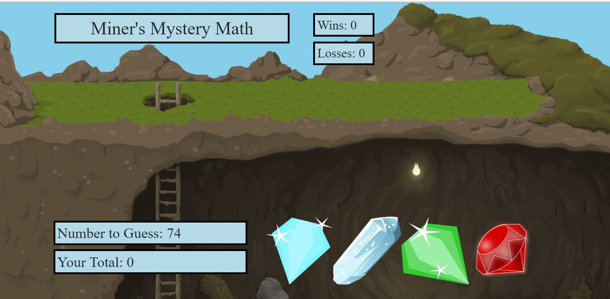

# unit-4-game

### Math game using javascript, jquery, modal and randomization

This is a game called "Miner's Mystery Math" where the player clicks gems with randomly assigned values to try to match a random, but known, number between 19 and 120.  The player wins if he or she can match the number exactly and loses if he or she goes over. The game will then restart with another round of play.  The game has a mining theme, and a modal featuring a miner pops up to tell the player whether they won or lost.

This game is useful for math practice in addition and also as a memory exercise since the player must remember how much each gem is worth.  The game is easy to play and starts with the press of the "start" button.  This project was created using HTML, CSS, Javascritpt files, and non-copyrighted images. It is hosted at https://marjika.github.io/unit-4-game/ and was created and is maintained by me, Marjika Howarth.